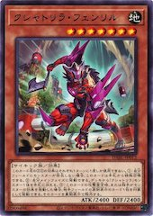

大家好啊，我是芬→里尔↓狼↑！  
今天给大家带来点想看的东西。  
  

クシャトリラ・フェンリル  
怒刹利巨狼地
:star::star::star::star::star::star::star:  
[念动力/效果]  
这个卡名的②③效果1回合各能使用1次。  
①：自己场上没有怪兽存在的场合，这张卡可以从手牌特殊召唤。  
②：自己的主要阶段可以发动。从卡组将1只「クシャトリラ／怒刹利」怪兽加入手牌。  
③：这张卡的攻击宣言时，或者对手发动怪兽的效果的场合，可以以对手场上的1张表侧表示的卡为对象发动。将那张卡以里侧表示除外。  

